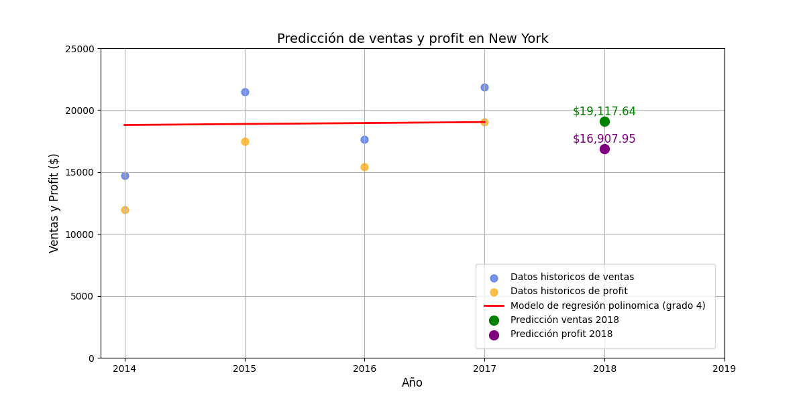

# Predicción de Ventas y Ganancias en Nueva York

Este repositorio contiene un modelo de regresión polinómica para predecir las ventas y ganancias en Nueva York durante el año 2018, utilizando datos históricos de ventas proporcionados por un dataset de Kaggle.

## Resultados de la Predicción

A continuación se muestra el gráfico de las predicciones de ventas y ganancias:

### Predicciones:

- **Ventas NY 2018**: $19,123.15
- **Profit NY 2018**: $16,912.82
- **R² del modelo**: 0.7855

## ¿Qué es el R²?

En este caso, el R² de **0.7855** indica que el modelo explica el **78.55%** de la variabilidad en las ventas de Nueva York.

## Fuente de los Datos

El dataset utilizado en este proyecto proviene de Kaggle.
