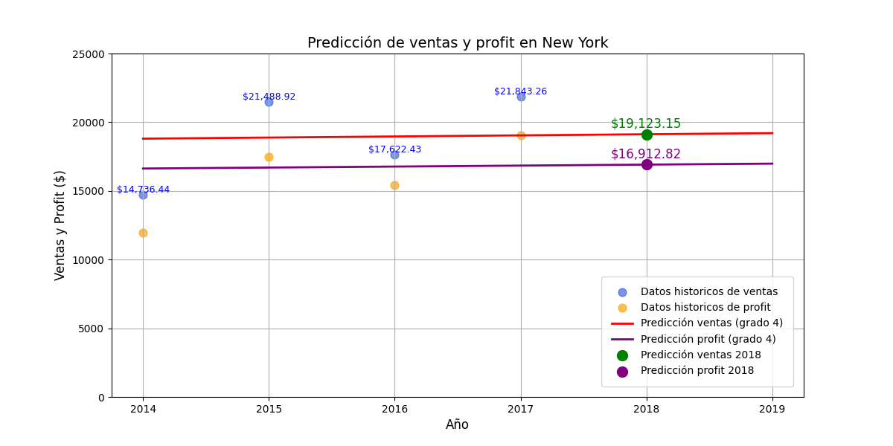

# Predicción de Ventas y Ganancias en Nueva York

Este repositorio contiene un modelo de regresión polinómica para predecir las ventas y ganancias en Nueva York durante el año 2018, utilizando datos históricos de ventas proporcionados por un dataset de Kaggle.

## Resultados de la Predicción

A continuación se muestra el gráfico de las predicciones de ventas y ganancias:

## Fuente de los Datos

El dataset utilizado en este proyecto proviene de Kaggle.

